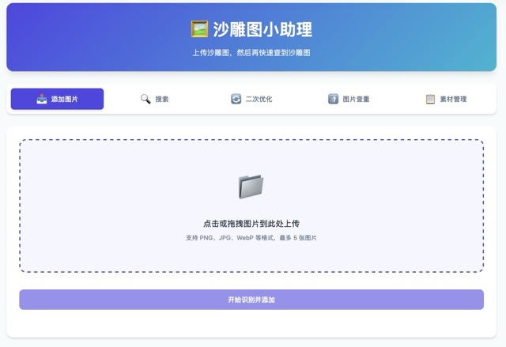

# 🏜️ 沙雕图小助理

> 用大模型理解你的沙雕图并保存，让每一张表情包都能被精准找回！

## ✨ 项目亮点

你是否也有这样的困扰？

- 😫 存了几千张沙雕图，想用的时候却找不到？
- 🔍 用文件名搜索？图名都是乱码时间戳...
- 🏷️ 手动打标签？打了几张就放弃了...
- 📱 想在微信聊天时直接搜索发送？

**本项目就是为解决这些痛点而生！**

利用大语言模型强大的图像理解能力，自动识别图片中的：
- 🎭 情绪表达（如：疑惑、震惊、无奈、阴阳怪气...）
- 📝 文字内容
- 🎬 梗来源与角色
- 💡 使用场景

相比传统的以图搜图，基于语义理解的搜索能精准找到相关的沙雕图！

## 🏗️ 项目架构

| 层级 | 技术选型 |
|------|---------|
| 后端框架 | FastAPI + Uvicorn/Gunicorn |
| 模板引擎 | Jinja2 |
| 素材存储 | 本地文件系统 |
| 前端交互 | 原生 JavaScript + CSS |
| 向量数据库 | ChromaDB |
| 大模型 | OpenAI 兼容接口 / 本地模型 API |
| 图片查重 | imagededup库 |
| 微信插件 | 通过 [sdt_bridge](https://github.com/ruijieball/sdt_bridge) 与微信 OpenClaw 插件集成 |

## 🚀 快速开始

### 系统要求

- Python 3.14+（非 Docker 部署）
- Docker（推荐）
- 大模型 API（OpenAI 兼容接口 / 本地部署的 Ollama 等）
- 内存 >2GB（向量模型加载需要）

### Docker 部署（推荐）

```bash
# 克隆项目
git clone https://github.com/ruijieball/sdt_assistant.git
cd sdt_assistant

# 编辑Makefile内相关配置，填入大模型 API 配置
vi Makefile

# 使用 Makefile 部署
make build   # 构建镜像
make run     # 启动服务（后台运行）
make logs    # 查看运行日志
make stop   # 停止服务

# 开始使用： http://localhost:8283/
```

首次启动会自动下载 ChromaDB 向量模型（默认为：Qwen3-Embedding-0.6B），请耐心等待。

### 手动部署

```bash
# 安装依赖
pip install -r requirements.txt

# 编辑config.py内相关配置，填入大模型 API 配置
vi config.py

# 启动服务
python main.py

# 开始使用： http://localhost:8283/
```

## 📱 微信插件集成

通过配套的 [sdt_bridge](https://github.com/ruijieball/sdt_bridge) 项目，可以在微信中直接使用！

## 配置说明

在 `Makefile` 中配置的环境变量会传递至  `config.py`，修改 `Makefile` / `config.py` 中的以下关键配置：

| 配置项 | 说明 | 默认值 |
|--------|------|--------|
| `LLM_API_URL` | 大模型 API 地址 | `http://localhost:11434/v1/` |
| `LLM_API_KEY` | API 密钥 | `ollama` |
| `LLM_MODEL` | 使用的大语言模型名称 | `qwen3.5:9b` |
| `LLM_TIMEOUT` | 大模型请求超时时间（秒） | `300` |
| `EMBEDDING_MODEL` | 向量嵌入模型 | `Qwen/Qwen3-Embedding-0.6B` |
| `HF_ENDPOINT` | HuggingFace 镜像（国内推荐） | `https://hf-mirror.com` |

## 📖 API 文档

启动后端后，访问 `http://localhost:8283/docs` 查看完整 API 文档。

主要接口：

| 接口 | 方法 | 说明 |
|------|------|------|
| `/` | GET | 主页面 |
| `/add` | POST | 上传图片并识别存储 |
| `/search` | GET | 语义搜索图片 |

## 其他说明

- 项目为自用，来自vibe coding，欢迎 Fork 二次开发
- 适合部署在 NAS 上，数据完全本地存储

## 界面截图




## 📄 许可证

MIT License